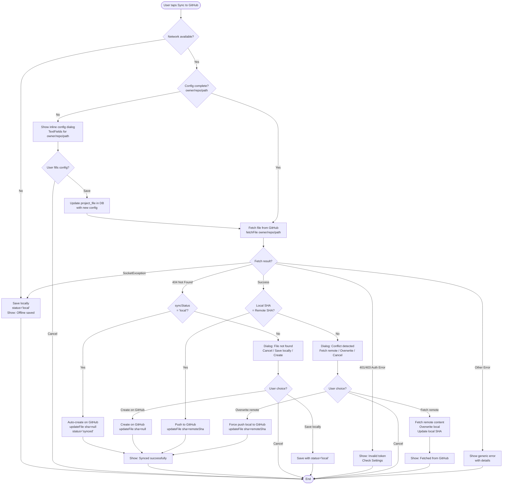

# Use Cases — GitHub Notes Sync Logic

> **Objectif** : Cartographier tous les scénarios de synchronisation entre l'app mobile et GitHub  
> **Date** : 2026-01-10  
> **Scope** : Limité aux scénarios essentiels (édition existante + création offline)

---

## 🎯 Scénarios Principaux

### 1️⃣ Édition fichier existant (cas nominal)
- **Pré-conditions** : Fichier déjà configuré (owner/repo/path), réseau OK
- **Workflow** :
  1. User modifie le contenu localement
  2. User appuie sur "Sync to GitHub"
  3. App fetch le fichier distant (`fetchFile()`)
  4. App compare SHA local vs distant
  5. **Si SHA identiques** → Push direct (pas de conflit)
  6. **Si SHA différents** → Dialog conflit (Fetch remote / Overwrite / Cancel)

### 2️⃣ Création fichier avec réseau (workflow rapide)
- **Pré-conditions** : Réseau OK, config GitHub déjà présente dans Settings
- **Workflow** :
  1. User crée nouveau fichier localement
  2. User configure owner/repo/path dans Settings OU inline dialog
  3. User appuie sur "Sync to GitHub"
  4. App tente `fetchFile()` → **404 File not found**
  5. App crée le fichier sur GitHub (`updateFile()` avec `sha: null`)

### 3️⃣ Création fichier offline (mode avion)
- **Pré-conditions** : PAS de réseau, idée d'app en mode avion
- **Workflow** :
  1. User crée nouveau fichier localement
  2. User modifie le contenu
  3. User appuie sur "Sync to GitHub"
  4. App tente `fetchFile()` → **SocketException** (offline)
  5. App sauvegarde en local avec `syncStatus = 'local'`
  6. SnackBar : "Offline: saved locally. Sync later when online."

### 4️⃣ Push fichiers locaux quand réseau revient
- **Pré-conditions** : Fichier(s) avec `syncStatus = 'local'`, réseau revient
- **Workflow** :
  1. User rouvre l'app (réseau disponible)
  2. User ouvre fichier avec status='local'
  3. User appuie sur "Sync to GitHub"
  4. **Si config manquante** (owner/repo/path vides) :
     - Dialog inline avec TextFields pour configurer
     - User remplit et sauvegarde
     - App update le `project_file` en DB
  5. App tente `fetchFile()` → **404** (fichier n'existe pas encore)
  6. App détecte `syncStatus = 'local'` → **auto-create sans dialog**
  7. App crée sur GitHub (`updateFile()` avec `sha: null`)
  8. Update `syncStatus = 'synced'`, `remoteSha = new SHA`

### 5️⃣ Gestion des conflits
- **Pré-conditions** : Fichier modifié localement ET sur GitHub (SHA différents)
- **Workflow** :
  1. User modifie localement
  2. User appuie sur "Sync to GitHub"
  3. App fetch distant → SHA distant ≠ SHA local
  4. Dialog : "Conflict detected. Remote file modified."
     - **Fetch remote version** → écrase local avec distant
     - **Overwrite remote** → force push local → distant
     - **Cancel** → rien ne change

### 6️⃣ Gestion des erreurs
- **401 Unauthorized** → "Invalid GitHub token. Check Settings."
- **403 Forbidden** → "Access denied. Check token permissions."
- **404 Not Found** + fichier pas local → Dialog "File not found" (Cancel / Save locally / Create)
- **404 Not Found** + status='local' → Auto-create (pas de dialog)
- **SocketException** → Offline mode (save avec status='local')
- **Autres erreurs** → Generic error message avec détails

---

## 📊 Flowchart Complet



---

## 🔑 Conditions Clés

### Détection Offline
```dart
try {
  final remoteFile = await githubService.fetchFile(...);
} on SocketException {
  // Mode offline → save avec status='local'
}
```

### Détection 404 (fichier n'existe pas)
```dart
try {
  final remoteFile = await githubService.fetchFile(...);
} on GitHubApiException catch (e) {
  if (e.statusCode == 404) {
    // Fichier n'existe pas → check si status='local' pour auto-create
  }
}
```

### Détection Conflit
```dart
final localSha = existing?.remoteSha;
final remoteSha = remoteFile.sha;

if (localSha != null && localSha != remoteSha) {
  // Conflit → show dialog
}
```

### Auto-create pour fichiers locaux
```dart
if (existing?.syncStatus == 'local') {
  // Pas de dialog, créer directement sur GitHub
  await githubService.updateFile(sha: null, ...);
}
```

---

## 📋 Matrice de Décision

| Condition                         | Action                              |
| --------------------------------- | ----------------------------------- |
| Réseau OK + config OK + SHA match | Push direct                         |
| Réseau OK + config OK + SHA diff  | Dialog conflit                      |
| Réseau OK + config manquante      | Dialog inline config → retry        |
| Réseau OK + 404 + status='local'  | Auto-create sans dialog             |
| Réseau OK + 404 + status≠'local'  | Dialog "File not found" (3 options) |
| Réseau KO (SocketException)       | Save local avec status='local'      |
| 401/403                           | Error: "Invalid token"              |

---

## 🚀 Next Steps (Validation)

1. **Tester scénario 1** : Édition fichier existant avec réseau OK
2. **Tester scénario 3** : Création offline (mode avion activé)
3. **Tester scénario 4** : Push fichier local quand réseau revient
4. **Tester scénario 5** : Conflit (modifier fichier distant manuellement)
5. **Tester erreurs** : Token invalide, repo inexistant, etc.

---

## 📝 Notes Techniques

- **SHA null** → création de fichier sur GitHub
- **SHA non-null** → mise à jour de fichier existant
- **status='local'** → fichier créé offline, pas encore sur GitHub
- **status='synced'** → fichier synchronisé avec GitHub
- **Inline config dialog** → permet de configurer owner/repo/path sans aller dans Settings

---

**Version** : 1.0  
**Maintainer** : @sedounet  
**Status** : Documentation complète, implémentation en cours de test
